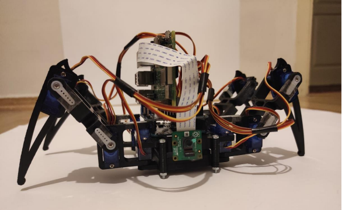

# Autonomous Spider Robot

## Owerview



## Dependecies

```
$pip3 install opencv-python
$pip3 install numpy
$pip3 install imutils
$pip3 install pyserial
```

### Lets Get Start

```
$cd ./rpi-object-detection
$python3 imageprocessingRpi.py
```

### Note

You should be compile and run
the [Arduino Code](https://github.com/beraterenterzi/image-processing-with-spider-robot/tree/main/arduino_servo_controller) for the run of spidy. real run :)) 

You can reach the video [here](https://www.youtube.com/watch?v=UTDP6wzKaus&ab_channel=BeratErenTerzio%C4%9Flu)
